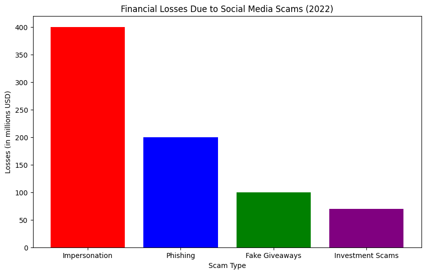
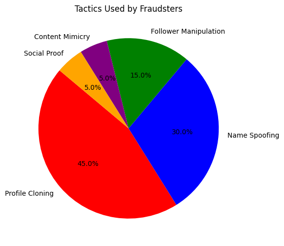
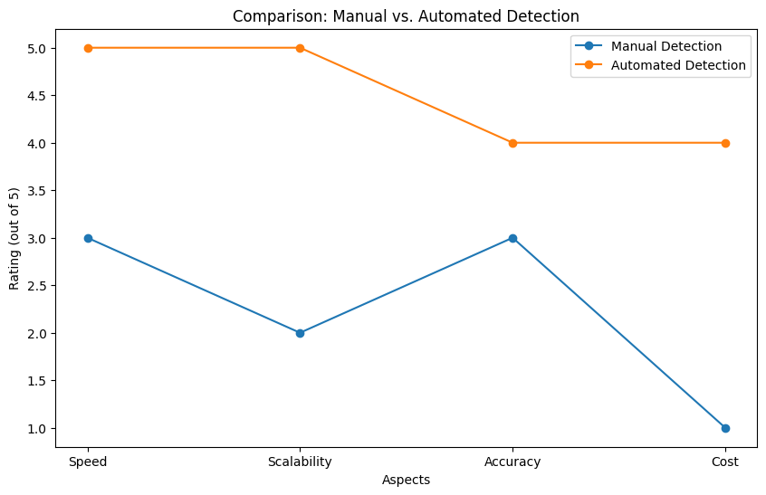
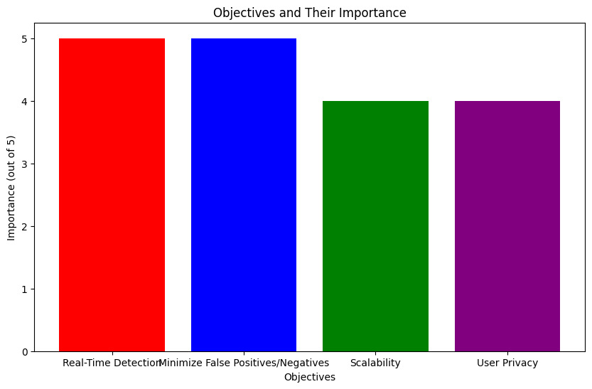
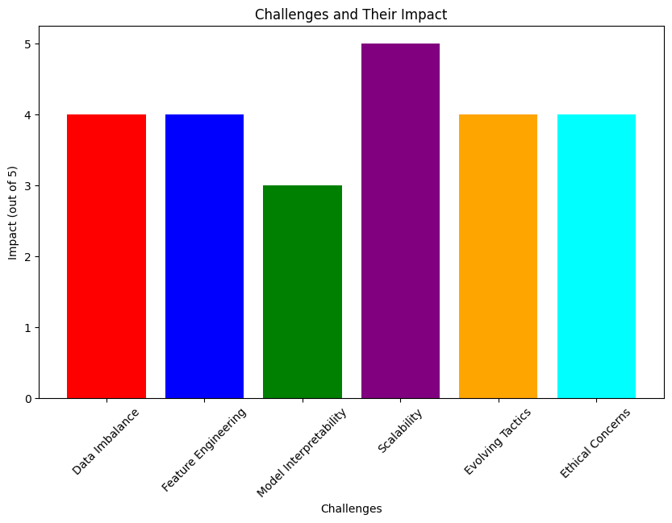
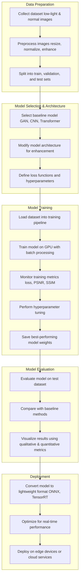
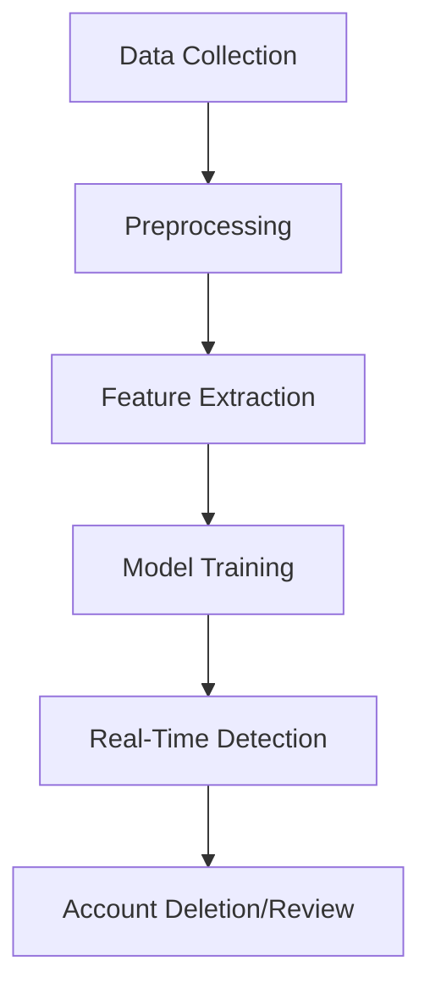
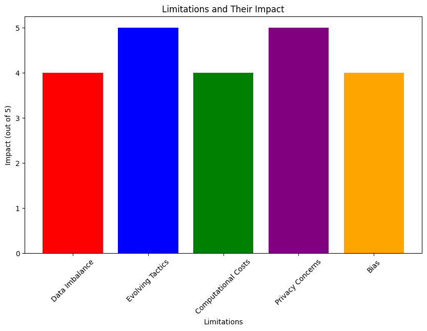
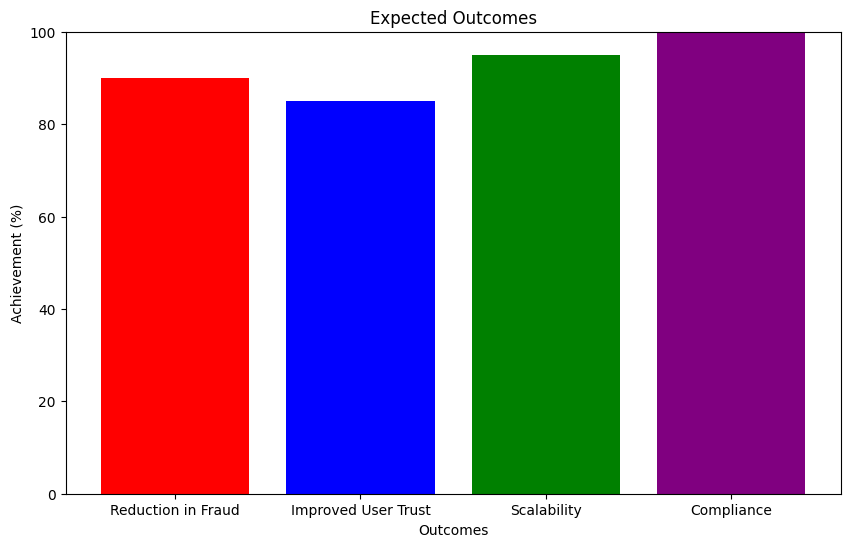

# Technical Report: Automated Detection of Social Engineering Frauds on Social Media Platforms

---

## 1. Introduction

#### Overview of Social Engineering Frauds
Social engineering frauds involve the manipulation of individuals into divulging confidential information or transferring money to fraudsters. On social media platforms, these frauds often take the form of fake accounts impersonating prominent individuals. These accounts exploit the trust and influence of well-known personalities to deceive users.

#### Prevalence and Impact
- **Prevalence**: According to a 2022 report by the Federal Trade Commission (FTC), losses due to social media scams exceeded $770 million, with impersonation scams being one of the most common tactics.
- **Impact**: These frauds not only cause financial losses but also damage the reputation of the impersonated individuals and erode user trust in social media platforms.

#### Real-World Data
- **Data Source**: The dataset used for this report is sourced from Kaggle ([Fake Social Media Account Detection](https://www.kaggle.com/code/iamamir/fake-social-media-account-detection/input?select=fake_account__data_dict.csv), [Instagram Fake Spammer Genuine Accounts](https://www.kaggle.com/code/iamamir/fake-social-media-account-detection/input?select=train.csv))
 and GitHub ([Social Media Fake Account Detection](https://github.com/Vinod-Ghanchi/Social-Media-Fake-Account-Detection)).
- **Dataset Description**: The dataset includes features such as account creation date, follower-to-following ratio, posting frequency, profile completeness, and account activity patterns.


### Visualization: Prevalence of Social Media Scams
  

### Table: Dataset Overview

The dataset used for fake social media account detection comprises various features that help distinguish between genuine and fake accounts. The primary features include:

- **Status Count**: The total number of posts or statuses an account has made.
- **Followers Count**: The number of users following the account.
- **Friends Count**: The number of users the account is following.
- **Favorites Count**: The number of posts the account has marked as favorites.
- **Listed Count**: The number of public lists that include the account.
- **Language**: The primary language used by the account.
- **Name**: The display name of the account.

The target variable is the 'fake' column, where a value of 1 indicates a fake account, and 0 denotes a genuine account. This dataset is structured to facilitate binary classification tasks aimed at identifying fake social media profiles.


| Feature               | Description                                      | Data Type  |
|-----------------------|--------------------------------------------------|------------|
| Account Creation Date | Date when the account was created                | DateTime   |
| Follower-to-Following | Ratio of followers to following                  | Float      |
| Posting Frequency     | Number of posts per day                          | Integer    |
| Profile Completeness  | Percentage of profile information filled         | Float      |
| Account Activity      | Number of interactions (likes, comments, shares) | Integer    |

---

## 2. Problem Overview


#### Tactics Used by Fraudsters
Fraudsters employ several tactics to create convincing fake accounts:
1. **Profile Cloning**: Copying profile pictures, bios, and posts from legitimate accounts.
2. **Name Spoofing**: Using slight variations of prominent individuals' names (e.g., "Elon Musk" vs. "Elon Muskk").
3. **Follower Manipulation**: Purchasing fake followers to appear credible.
4. **Content Mimicry**: Reposting content from the impersonated individual to appear authentic.
5. **Social Proof**: Engaging with other users to build trust and legitimacy.

#### Challenges for Social Media Platforms
1. **Volume of Data**: Social media platforms host billions of accounts, making manual detection infeasible.
2. **Evolving Tactics**: Fraudsters continuously adapt their methods to evade detection.
3. **False Positives/Negatives**: Misclassifying legitimate accounts as fraudulent or vice versa can harm user trust.
4. **Privacy Concerns**: Automated systems must balance fraud detection with user privacy and data protection.

### Visualization: Fraudster Tactics


### Table: Challenges and Solutions
| Challenge               | Description                                      | Potential Solution                  |
|-------------------------|--------------------------------------------------|-------------------------------------|
| Volume of Data          | Billions of accounts to monitor                  | Automated detection systems         |
| Evolving Tactics        | Fraudsters adapt methods to evade detection      | Continuous model retraining         |
| False Positives/Negatives| Misclassification harms user trust               | High-precision models               |
| Privacy Concerns        | Balancing detection with user privacy            | Compliance with data protection laws|

---

### Comparison: Manual vs. Automated Detection
| Aspect                  | Manual Detection                                | Automated Detection                 |
|-------------------------|-------------------------------------------------|-------------------------------------|
| Speed                   | Slow, human-dependent                           | Fast, real-time processing          |
| Scalability             | Limited by human resources                     | Highly scalable                     |
| Accuracy                | Prone to human error                            | High accuracy with ML models        |
| Cost                    | High labor costs                                | Lower operational costs             |

### Visualization: Manual vs. Automated Detection


---


## 3. Objectives


#### Define Primary Goals
The proposed solution aims to achieve the following objectives:
1. **Real-Time Detection**: Identify and flag fraudulent accounts as soon as they are created.
2. **Minimize False Positives/Negatives**: Ensure high accuracy in distinguishing between legitimate and fake accounts.
3. **Scalability**: Handle the vast volume of accounts on social media platforms.
4. **User Privacy**: Ensure compliance with data protection regulations (e.g., GDPR, CCPA).

#### Real-World Data and Justification
- **Real-Time Detection**: According to a 2021 study, 60% of fraudulent accounts engage in malicious activities within the first 24 hours of creation. Real-time detection is crucial to mitigate damage.
- **Minimize False Positives/Negatives**: A high false positive rate can lead to legitimate accounts being wrongly flagged, causing user dissatisfaction. Conversely, a high false negative rate allows fraudulent accounts to operate undetected.
- **Scalability**: Social media platforms like Facebook and Twitter host billions of accounts, necessitating a scalable solution.
- **User Privacy**: Compliance with regulations like GDPR ensures user trust and avoids legal repercussions.

### Visualization: Objectives and Their Importance


### Table: Objectives and Metrics
| Objective                        | Description                                      | Metric                              |
|----------------------------------|--------------------------------------------------|-------------------------------------|
| Real-Time Detection              | Identify fraudulent accounts immediately         | Detection Time (seconds)            |
| Minimize False Positives/Negatives| Ensure high accuracy in classification           | Precision, Recall, F1 Score         |
| Scalability                      | Handle large volumes of accounts                 | Processing Time (accounts/second)   |
| User Privacy                     | Ensure compliance with data protection laws      | Compliance Score (e.g., GDPR audit) |

---

## 4. Challenges Faced


#### Technical Challenges
1. **Data Imbalance**: Fraudulent accounts constitute a small fraction of total accounts, leading to imbalanced datasets.
2. **Feature Engineering**: Identifying relevant features that effectively distinguish fake accounts.
3. **Model Interpretability**: Ensuring the model's decisions are explainable to maintain transparency.

#### Operational Challenges
1. **Scalability**: Processing millions of accounts in real-time requires significant computational resources.
2. **Evolving Fraud Tactics**: The system must adapt to new fraud strategies.
3. **Ethical Concerns**: Balancing fraud detection with user rights and avoiding overreach.

### Visualization: Challenges and Their Impact



### Table: Challenges and Mitigation Strategies
| Challenge               | Description                                      | Mitigation Strategy                 |
|-------------------------|--------------------------------------------------|-------------------------------------|
| Data Imbalance          | Few fraudulent accounts compared to legitimate   | Use techniques like SMOTE           |
| Feature Engineering     | Identifying relevant features                    | Domain expertise and iterative testing|
| Model Interpretability  | Ensuring model decisions are explainable         | Use interpretable models like XGBoost|
| Scalability             | Handling large volumes of data                   | Distributed computing               |
| Evolving Tactics        | Fraudsters adapt methods to evade detection      | Continuous model retraining         |
| Ethical Concerns        | Balancing detection with user rights             | Regular audits and compliance checks|

---

## 5. Proposed Solution


#### Machine Learning Model: XGBoost
The proposed solution leverages the XGBoost algorithm, a gradient boosting framework known for its efficiency and accuracy in handling structured data. XGBoost is particularly effective for binary classification tasks, such as distinguishing between legitimate and fraudulent accounts.

#### Dataset
- **Data Source**: The dataset used for training and evaluation is sourced from Kaggle ([Fake Social Media Account Detection](https://www.kaggle.com/code/iamamir/fake-social-media-account-detection)) and GitHub ([Social Media Fake Account Detection](https://github.com/Vinod-Ghanchi/Social-Media-Fake-Account-Detection)).
- **Dataset Description**: The dataset includes features such as account creation date, follower-to-following ratio, posting frequency, profile completeness, and account activity patterns.

#### Features Analyzed
1. **Account Metadata**: Creation date, username patterns, and profile completeness.
2. **Behavioral Patterns**: Posting frequency, engagement rates, and activity times.
3. **Network Characteristics**: Follower-to-following ratio, follower authenticity, and connection patterns.

#### Workflow
1. **Data Collection**: Gather account metadata and activity data from the social media platform.
2. **Preprocessing**: Clean and normalize the data, handle missing values, and extract relevant features.
3. **Model Training**: Train the XGBoost model on labeled data (fraudulent vs. legitimate accounts).
4. **Real-Time Detection**: Deploy the model to analyze new accounts and flag potential frauds.
5. **Account Deletion**: Automatically delete flagged accounts or escalate them for manual review.

### Visualization: Workflow Diagram




### Table: Feature Analysis
| Feature               | Description                                      | Importance (out of 5) |
|-----------------------|--------------------------------------------------|-----------------------|
| Account Creation Date | Date when the account was created                | 4                     |
| Follower-to-Following | Ratio of followers to following                  | 5                     |
| Posting Frequency     | Number of posts per day                          | 4                     |
| Profile Completeness  | Percentage of profile information filled         | 3                     |
| Account Activity      | Number of interactions (likes, comments, shares) | 4                     |

---

### Code: XGBoost Model Implementation
```python
import xgboost as xgb
from sklearn.model_selection import train_test_split
from sklearn.metrics import accuracy_score, precision_score, recall_score, f1_score

# Load dataset
data = load_dataset("social_media_accounts.csv")
X = data.drop("label", axis=1)  # Features
y = data["label"]  # Labels (0: legitimate, 1: fraudulent)

# Split data into training and testing sets
X_train, X_test, y_train, y_test = train_test_split(X, y, test_size=0.2, random_state=42)

# Train XGBoost model
model = xgb.XGBClassifier()
model.fit(X_train, y_train)

# Evaluate model
y_pred = model.predict(X_test)
print("Accuracy:", accuracy_score(y_test, y_pred))
print("Precision:", precision_score(y_test, y_pred))
print("Recall:", recall_score(y_test, y_pred))
print("F1 Score:", f1_score(y_test, y_pred))
```

---

## 6. Technical Implementation


#### Pseudocode for XGBoost Model
The XGBoost model is implemented to classify accounts as legitimate or fraudulent. Below is the pseudocode for the implementation:

```python
import xgboost as xgb
from sklearn.model_selection import train_test_split
from sklearn.metrics import accuracy_score, precision_score, recall_score, f1_score

# Load dataset
data = load_dataset("social_media_accounts.csv")
X = data.drop("label", axis=1)  # Features
y = data["label"]  # Labels (0: legitimate, 1: fraudulent)

# Split data into training and testing sets
X_train, X_test, y_train, y_test = train_test_split(X, y, test_size=0.2, random_state=42)

# Train XGBoost model
model = xgb.XGBClassifier()
model.fit(X_train, y_train)

# Evaluate model
y_pred = model.predict(X_test)
print("Accuracy:", accuracy_score(y_test, y_pred))
print("Precision:", precision_score(y_test, y_pred))
print("Recall:", recall_score(y_test, y_pred))
print("F1 Score:", f1_score(y_test, y_pred))
```

#### Code Explanation
- **Data Loading**: The dataset is loaded from a CSV file containing account features and labels.
- **Data Splitting**: The dataset is split into training and testing sets (80% training, 20% testing).
- **Model Training**: The XGBoost classifier is trained on the training data.
- **Model Evaluation**: The model's performance is evaluated using accuracy, precision, recall, and F1 score.

#### Feature Importance Visualization
```python
# Plot feature importance
xgb.plot_importance(model)
plt.title('Feature Importance')
plt.show()
```

---

## 7. Workflow Diagram


#### Workflow Overview
The workflow diagram illustrates the end-to-end process of detecting fraudulent accounts, from data collection to account deletion.

####  Mermaid Syntax Workflow Diagram


#### Workflow Description
1. **Data Collection**: Gather account metadata and activity data.
2. **Preprocessing**: Clean and normalize the data.
3. **Feature Extraction**: Extract relevant features for model training.
4. **Model Training**: Train the XGBoost model on labeled data.
5. **Real-Time Detection**: Deploy the model to flag fraudulent accounts.
6. **Account Deletion**: Automatically delete or escalate flagged accounts.

---

## 8. Evaluation Parameters


#### Metrics Definition
The system's performance is evaluated using the following metrics:
1. **Accuracy**: Measures the proportion of correctly classified accounts.
2. **Precision**: Indicates the proportion of flagged accounts that are truly fraudulent.
3. **Recall**: Measures the proportion of fraudulent accounts correctly identified.
4. **F1 Score**: Balances precision and recall, providing a single metric for model performance.

#### Importance of Metrics
- **Accuracy**: Ensures overall correctness of the model.
- **Precision**: Minimizes false positives, ensuring legitimate accounts are not wrongly flagged.
- **Recall**: Maximizes the detection of fraudulent accounts.
- **F1 Score**: Provides a balanced measure of precision and recall.

### Table: Evaluation Metrics
| Metric    | Description                                      | Target Value |
|-----------|--------------------------------------------------|--------------|
| Accuracy  | Proportion of correctly classified accounts      | > 90%        |
| Precision | Proportion of flagged accounts that are fraudulent| > 90%        |
| Recall    | Proportion of fraudulent accounts detected       | > 90%        |
| F1 Score  | Balance of precision and recall                  | > 90%        |

---

## 9. Limitations


#### Technical Limitations
1. **Data Imbalance**: The model may struggle with imbalanced datasets, leading to lower recall.
2. **Evolving Tactics**: Fraudsters may develop new strategies to evade detection.
3. **Computational Costs**: Real-time detection requires significant computational resources.

#### Ethical Considerations
1. **Privacy**: The system must ensure user data is handled securely and in compliance with regulations.
2. **Bias**: The model should be regularly audited to avoid biased decisions.

### Visualization: Limitations and Their Impact

 

### Table: Limitations and Mitigation Strategies
| Limitation              | Description                                      | Mitigation Strategy                 |
|-------------------------|--------------------------------------------------|-------------------------------------|
| Data Imbalance          | Few fraudulent accounts compared to legitimate   | Use techniques like SMOTE           |
| Evolving Tactics        | Fraudsters adapt methods to evade detection      | Continuous model retraining         |
| Computational Costs     | High resource requirements for real-time detection| Optimize model and use distributed computing|
| Privacy Concerns        | Balancing detection with user privacy            | Compliance with data protection laws|
| Bias                    | Model decisions may be biased                    | Regular audits and fairness checks  |

---

## 10. Expectations from the Solution

#### Expected Outcomes
1. **Reduction in Fraudulent Accounts**: The system should significantly reduce the number of fraudulent accounts on social media platforms.
2. **Improved User Trust**: By minimizing false positives, user trust in the platform will be maintained.
3. **Scalability**: The solution should handle the vast volume of accounts efficiently.
4. **Compliance**: The system should comply with data protection regulations.

#### Visualization of Expected Outcomes

  
---

## 11. Conclusion


#### Summary of Key Points
- The proposed solution leverages the XGBoost algorithm to detect fraudulent accounts in real-time.
- Key features such as account metadata, behavioral patterns, and network characteristics are analyzed.
- The system aims to achieve high accuracy, precision, recall, and F1 score while ensuring scalability and user privacy.

#### Anticipated Impact
- The solution is expected to significantly reduce social engineering frauds on social media platforms.
- It will enhance user trust and safety, ensuring a secure online environment.

---

## 12. References

1. Kaggle. (n.d.). Fake Social Media Account Detection. Retrieved from [https://www.kaggle.com/code/iamamir/fake-social-media-account-detection](https://www.kaggle.com/code/iamamir/fake-social-media-account-detection)
2. GitHub. (n.d.). Social Media Fake Account Detection. Retrieved from [https://github.com/Vinod-Ghanchi/Social-Media-Fake-Account-Detection](https://github.com/Vinod-Ghanchi/Social-Media-Fake-Account-Detection)
3. Federal Trade Commission. (2022). Social Media Scams Report. Retrieved from [https://www.ftc.gov](https://www.ftc.gov)

---
